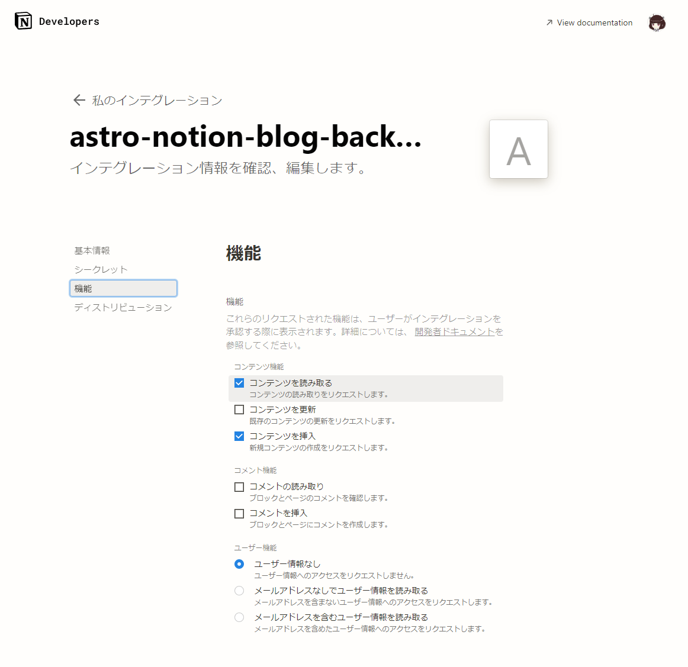
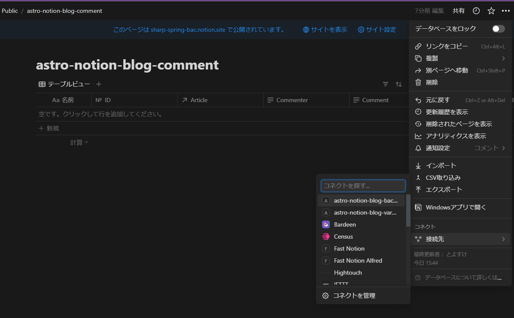
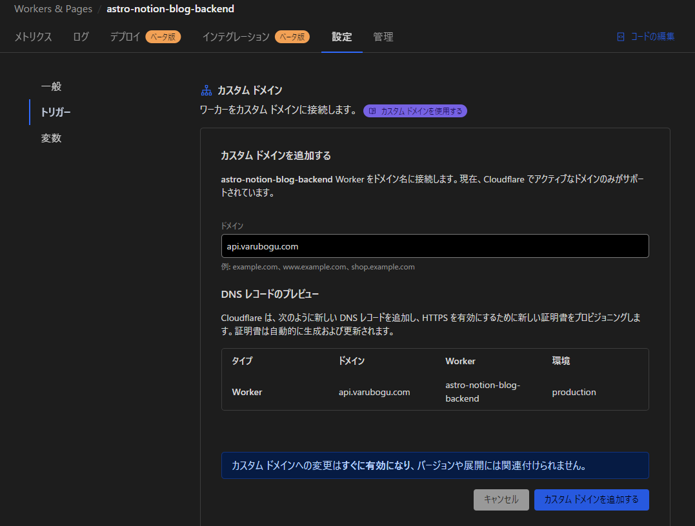

[English](README.md) | 日本語

# astro-notion-blog-backend

[astro-notion-blog](https://github.com/otoyo/astro-notion-blog) で使用可能なバックエンドAPIサーバー

## 機能一覧

### コメント投稿機能

記事に対してコメントを投稿できます。
コメントはNotionのデータベースで管理します。

` https://ドメイン名/api/v1/comments/add`

に対して
```json
{
    name: "ヴァルボーグ",
    comment: "テストコメントです。",
    slug: "sample-article"
}
```
というJSONをPOSTすると投稿できます。
slugについてはastro-notion-blogで使用しているslugです。（つまりURLの一部になっているアレ）

## 設定方法

### Notionのコメントデータベースをコピー

下記データベースをコピーし、Notion内の好きな場所に置いてください。
https://sharp-spring-bac.notion.site/a74be7d72a1745fe9f229c136a43c6a8?v=2a463a38f818466bbabfe69f5d57338f&pvs=4

その後、データベースの「Article」列（リレーション）をastro-notion-blogで使っているデータベースとリンクさせてください。

### Notionインテグレーションの設定

インテグレーションを作成し以下の権限を設定します。

- コンテンツ機能>コンテンツを読み取る
- コンテンツ機能>コンテンツを挿入



作成したインテグレーションはastro-notion-blogで使用しているデータベースと、先程コピーしたコメント用のデータベースの２つに対して設定します。


備考:
このバックエンドではコメントへの書き込み機能とブログへの読み込みを持たせたいところですが、Notionのインテグレーションの権限設定では片方のデータベースでは読み取りを許可し、もう片方のデータベースは書き込みも許可するような個別の権限付与は現状のNotionの仕様上できません。


余談ですが、ページ追加時のオートメーションでSlackから通知が来るようにすると便利です。

### Cloudlare Workersでホスティングする場合

あらかじめwranglerをインストールし、ログインしておいてください
```bash
npm install -g wrangler
wrangler login
```

wrangler.tomlを開き、

```toml
name = "astro-notion-blog-backend"
```

を任意の文字列に変更します。（サイト名称になります）

#### 環境変数を設定

astro-notion-blogをデプロイする時と同じように、設定>環境変数>環境変数を設定します。
Cloudflare Workers & Pages > デプロイした名前のサイトを選択 > 設定 > 変数 > 環境変数
設定するものは以下の通りです。

|環境変数名|説明|
|---|---|
|NOTION_API_SECRET | NotionSDKで利用するインテグレーションのシークレット |
|NOTION_DATABASE_POSTS_ID | ブログのデータベースID |
|NOTION_DATABASE_COMMENTS_ID | コメントのデータベースID |
|MAINSITE_DOMAIN | astro-notion-blogで動かしているサイトのドメイン名 |

ローカルで動かしたい場合、
.dev.vars.example をコピーして、名前を .dev.vars に変更し、環境変数を書き込んでください。

#### ローカル実行

```bash
npm run dev
```

#### Workersデプロイ

```bash
npm run deploy
```

#### ドメイン設定

（あらかじめメインのドメイン設定は済ませておくものとします）
Cloudflare Workers & Pages > デプロイした名前のサイトを選択 > 設定 > トリガー > カスタムドメインを追加する
任意の名前を入力してカスタムドメインを追加してください。



### Cloudflare以外でホスティングしたい場合

現状、Cloudflare以外の動作確認はしていません。
このバックエンドは状態を持たないため、AWS LambdaなどのFaaSでも実行できます。


## 使用ライブラリについて

このプロジェクトでは以下のライブラリを使用しています。

### Bun

- 高速なJavaScriptランタイムで、モダンな開発体験を提供します。
- 公式サイト: https://bun.sh/
- GitHub: https://github.com/oven-sh/bun
- ライセンス: [MIT License](https://github.com/oven-sh/bun/blob/main/LICENSE)

### Hono

- 高性能なWebフレームワークで、シンプルかつ柔軟なAPIを提供します。
- 公式サイト: https://hono.dev/
- GitHub: https://github.com/honojs/hono
- ライセンス: M[MIT License](https://github.com/honojs/hono/blob/main/LICENSE)

### Zod

- スキーマ宣言とバリデーションのためのTypeScriptライブラリです。強力な型安全性を提供します。
- 公式サイト: https://zod.dev/
- GitHub: https://github.com/colinhacks/zod
- ライセンス: [MIT License](https://github.com/colinhacks/zod/blob/master/LICENSE)

### Wrangler

- Cloudflare Workersを管理するためのCLIツールで、サーバーレスアプリケーションのデプロイを簡単にします。
- 公式サイト: https://developers.cloudflare.com/workers/cli-wrangler
- GitHub: https://github.com/cloudflare/wrangler
- ライセンス: [Apache License 2.0, MIT License](https://github.com/cloudflare/wrangler/blob/master/LICENSE)