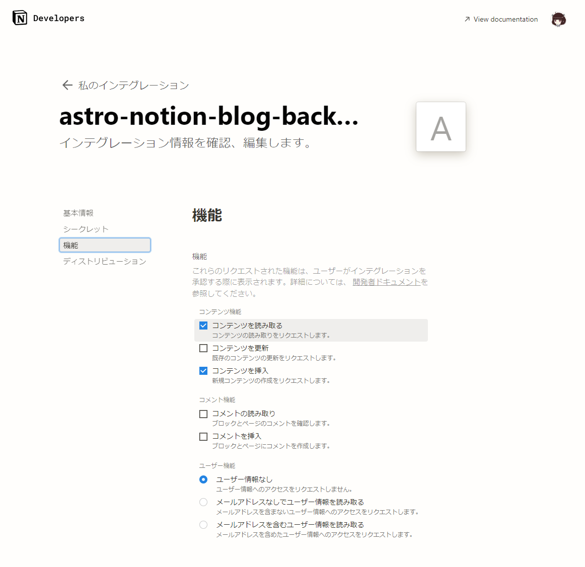
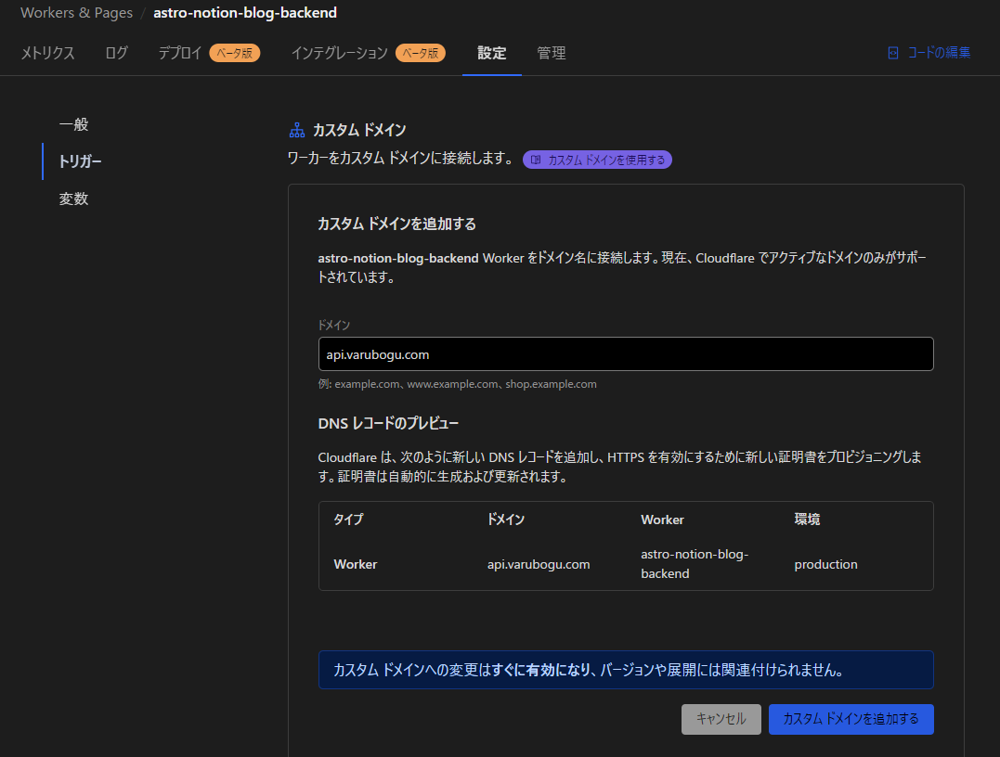

English | [日本語](README.ja.md)

# astro-notion-blog-backend

Backend API server available for use with [astro-notion-blog](https://github.com/otoyo/astro-notion-blog)

## Features

### Comment Posting

You can post comments on articles. Comments are managed in a Notion database.

To post a comment, send the following JSON to
`https://your-domain/api/v1/comments/add`:

```json
{
    "name": "Valborg",
    "comment": "This is a test comment.",
    "slug": "sample-article"
}
```

The "slug" refers to the slug used in astro-notion-blog (i.e., the part of the URL).

## Setup Instructions

### Copy the Notion Comment Database

Copy the following database and place it anywhere in your Notion workspace:
<https://sharp-spring-bac.notion.site/a74be7d72a1745fe9f229c136a43c6a8?v=2a463a38f818466bbabfe69f5d57338f&pvs=4>

Then, link the "Article" column (relation) of the database to the database used by astro-notion-blog.

### Get Notion Data Source ID

This operation needs to be performed for both the blog data source ID and the comment data source ID.

To get the Notion data source ID, follow these steps:
1. Open the "Settings" of the Notion database
2. Open "Manage data source"
3. Select "Copy data source ID" from the three-dot menu of "Data source"
4. Set the data source ID as an environment variable

Note: Previously, DATABASE_ID was used, but due to changes in the Notion API, DATASOURCE_ID is now used.

### Configure Notion Integration

Create an integration and set the following permissions:

- Content Capabilities > Read content
- Content Capabilities > Insert content



Apply the created integration to both the database used by astro-notion-blog and the comment database you just copied.


Note:
We would like this backend to have the ability to write to comments and read from the blog, but the current Notion specifications do not allow individual permissions to be granted, such as allowing read access to one database and writing access to the other, in the permission settings of the Notion integration.

For convenience, you can set up an automation to notify you via Slack when a new page is added.

### Hosting with Cloudflare Workers

Install and log in to wrangler in advance:
```bash
npm install -g wrangler
wrangler login
```

Open `wrangler.toml` and change
```toml
name = "astro-notion-blog-backend"
```
to any string you like (this will be the site name).

#### Set Environment Variables

Set the environment variables just like when deploying astro-notion-blog:
Cloudflare Workers & Pages > Select the deployed site > Settings > Variables > Environment Variables

Set the following:

| Environment Variable Name | Description |
|---|---|
| NOTION_API_SECRET | Secret for the integration used by NotionSDK |
| ~~NOTION_DATABASE_POSTS_ID~~ | ~~Database ID for the blog~~ |
| NOTION_DATASOURCE_POSTS_ID | Data source ID for the blog |
| ~~NOTION_DATABASE_COMMENTS_ID~~ | ~~Database ID for comments~~ |
| NOTION_DATASOURCE_COMMENTS_ID | Data source ID for comments |
| MAINSITE_DOMAIN | Domain name of the site running astro-notion-blog |

Note: Previously, DATABASE_ID was used, but due to changes in the Notion API, DATASOURCE_ID is now used.

If you want to run it locally, copy `.dev.vars.example` to `.dev.vars` and write in the environment variables.

#### Local Execution

```bash
npm run dev
```

#### Workers Deployment

```bash
npm run deploy
```

#### Domain Settings

(Assuming the main domain settings are already done)
Cloudflare Workers & Pages > Select the deployed site > Settings > Triggers > Add Custom Domain
Enter a name and add the custom domain.



### Hosting on Non-Cloudflare Platforms

Currently, operation on platforms other than Cloudflare has not been verified. This backend is stateless, so it can also run on FaaS platforms like AWS Lambda.

## Libraries Used

This project uses the following libraries:

### Bun

- A fast JavaScript runtime providing a modern development experience.
- Official site: <https://bun.sh/>
- GitHub: <https://github.com/oven-sh/bun>
- License: [MIT License](https://github.com/oven-sh/bun/blob/main/LICENSE)

### Hono

- A high-performance web framework offering simple and flexible APIs.
- Official site: <https://hono.dev/>
- GitHub: <https://github.com/honojs/hono>
- License: [MIT License](https://github.com/honojs/hono/blob/main/LICENSE)

### Zod

- A TypeScript library for schema declaration and validation, providing strong type safety.
- Official site: <https://zod.dev/>
- GitHub: <https://github.com/colinhacks/zod>
- License: [MIT License](https://github.com/colinhacks/zod/blob/master/LICENSE)

### Wrangler

- A CLI tool for managing Cloudflare Workers, simplifying serverless application deployment.
- Official site: <https://developers.cloudflare.com/workers/cli-wrangler>
- GitHub: <https://github.com/cloudflare/wrangler>
- License: [Apache License 2.0, MIT License](https://github.com/cloudflare/wrangler/blob/master/LICENSE)
